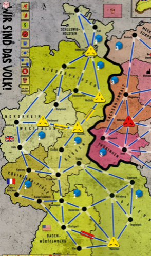
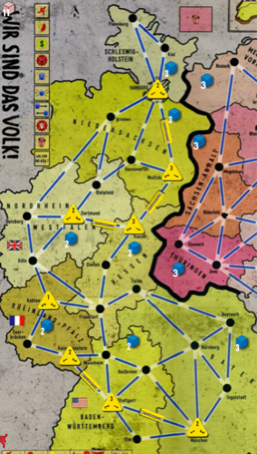
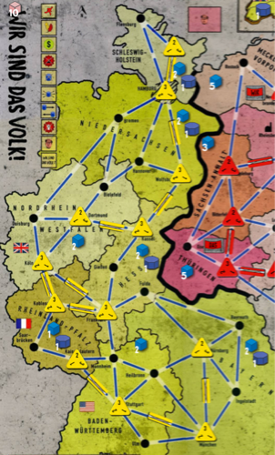

🇩🇪

[Wir Sind Das Volk!](https://boardgamegeek.com/boardgame/165401/wir-sind-das-volk) is a good board game.

These thoughts will not be meaningful without knowledge of the [rules](http://www.histogame.de/WSDV/Wir.sind.das.Volk.Rules.pdf) and perhaps a few games in person, or on [boardgamescore](http://play.boardgamecore.net).

### Short forms

I will use the following short forms.

| SHORT FORM | MEANING                                                  |
| ---------- | -------------------------------------------------------- |
| 😡         | unrest                                                   |
| 👿         | mass protest                                             |
| ❌😡        | removing unrest                                          |
| ❌👿        | removing mass protest                                    |
| 😁         | living standard                                          |
| 🛠         | build                                                    |
| ❌🛠        | dismantle                                                |
| 🏭         | factory                                                  |
| 🔽🏭       | rundown                                                  |
| 🛣         | infrastructure                                           |
| ⭐          | the prestige track                                       |
| 💵         | the western currency track                               |
| ☭          | the socialist track                                      |
| 🖐🃏       | hand cards                                               |
| -6⭐️       | the spot on the prestige track closest to **West**       |
| +3☭        | the spot on the socialist track 3 steps towards **East** |
| D1         | decade 1                                                 |
| D2.0       | the first half of decade 2                               |
| D3.5       | the second half of decade 3                              |
| P1         | the player going first in the decade                     |
| P2         | the player going second in the decade                    |
| WC         | western currency (not the track)                         |
| WB         | West Berlin                                              |

### General play

#### Choosing card modes

🛠 is an important action. 🛠🛣 is more economy-efficient as it increases economy by 2 while a new 🏭 increases economy by 1. It's important to have a plan on where to 🛠 ([west](#Where-to-build-and-LS-West-) | [east](#Where-to-build-and-LS-East)) to maximise 🛣 while meeting other economic objectives.

Playing a card for the event is often worse than using it for 🛠. It's important to have some kind of exchange rate between different effects and regular 🛠. For example, although the _1953 Uprising_ has a strong effect, the 4🛠 are often more valuable in D1.

Adding 😁 is more efficiently done with 1-value cards, as the shortfall that it bridges could usually be replaced by a 🛠, which is permanent, which contributes to economy/export factory value and also can be dismantled for future ❌😡 actions.

❌😡 actions can be important to ❌👿, and they can be important for East in D4. In other cases, they is not efficient.

#### Playing cards from the board

In each half-decade, 7 cards are laid out on the board. Each card is often worth a different value to each player. For example, _1953 Uprising_ is worth at least 4🛠 to West and at least 1🛠 to East. We can say that the swing value is at least 5🛠. Naively, we can say that we can extract most relative value from the board cards by taking the cards with the highest swing value. However, the values of cards in WSDV are often dynamic depending on board state, tracks, 🖐🃏 and other cards on the board. Nevertheless, it's useful to think about the swing value of cards.

#### Playing hand cards 🖐🃏

It is generally best to play 🖐🃏 when 1 card is left on the board in the first half of each decade (D1.5, D2.5, ...). In every other situation, the opponent gets to take an extra card from the board, which results in them either getting better picks of the cards or them getting to play more cards than us.

In the usual case, at the end of each first-half-decade, P1 has the power to choose how many 🖐🃏 to play and P2 must either follow suit or give up the first pick of the second-half-decade, which is the card with the highest swing value. As there are some particularly strong cards in each decade, this is a great advantage of being P1.

P1 should play their strong 🖐🃏 at the end of each first-half-decade. A large advantage can be gained if they have strong 🖐🃏 and P2 is forced to play weak 🖐🃏. If P1 has weak 🖐🃏, they can _rush_ the decade by playing no 🖐🃏 and P2 will need to give up some board cards to play his 🖐🃏. P1 should generally not play weak 🖐🃏, since it gives P2 an easy opportunity to play a strong 🖐🃏 if they have one (or the build the wall in D2).

There are two exceptions to playing strong 🖐🃏 at the ends of the first-half-decades. The first is having ❌😡 in hand as West in D2 and the board having no 👿. It is good to save the ❌😡 until after East plays 😡 cards in D2.5. The second exception is having _Shipyards Crisis_ or _Oil Crisis_ as East. These are often useful to save for late in the decade to play, where the opponent often cannot repair the damage done from ❌🛠 before the decade ends.

#### The prestige track ⭐️

⭐️ is of high importance overall, but parts of the ⭐️ track differ in [_temperature_](https://senseis.xmp.net/?TemperatureCGT) (urgency of contesting the track). The middle of the track, between -1⭐️ and +1⭐️ is the hottest. Between -1⭐️ and -4⭐️ is the coolest part of the track, as there is relatively little difference between 1🔽🏭 and 1❌🛠 + 1😡.

Becoming P1 is an important reward of ⭐️. P1 decides how many 🖐🃏 can be conveniently played in the decade and P1 gets increased value from odd numbers of flight ❌🛠 and 🔽🏭 from WC shortage.

Gaining 1🛠 as East is also a great reward. It often allows East to negate the effects of flight ❌🛠 hurting East's export factories (which cause WC shortage and 🔽🏭).

1❌😡 as East is comparable to gaining 1🛠. It's sometimes worse. The +3⭐ bonus is strong, with both 1 🛠 and 1 ❌😡. It's often stronger than the +4⭐️ bonus of 😁. The 😁 needs to be maintained by economy and paid for by WC, and is generally only good in D4 when survival is all that matters.

Going past +6⭐️ as East is a rare occurrence, but is powerful when 😡 is already a problem for West.

Gaining 1🔽🏭 as West is a similarly powerful reward. 🏭 which haven't been run down are important resources to skilled East players, because they prevent WC shortage in D4 from dismantling infrastructure. The 1🔽🏭 can often cause a WC shortage especially in D1, which is worth another 1🔽🏭.

LS removal at -5⭐️ and -6⭐️ is generally very strong, once West's border provinces have at least 2😁 on them. What commonly happens is that 1❌😁 leads to 2 to 3 extra 😡 hits, 2 from the neighbouring West provinces and 1 from internal 😁 comparison if any East provinces have 2😁 already. This means that -5⭐️ and -6⭐️ can cause a total of 3-4😡, which can be a killing blow to an otherwise solid East side in D4.

#### The socialist track ☭

☭ is arguably the most important track, as either side can directly win the game through it. Exactly how important it is in a particular game depends on ☭ at the end of D1. West can pressure a socialist victory if D1 ends at +1☭ or better, while East can pressure a socialist victory at +5☭ or +6☭. It's important, thus, for both players to try to reach their respective zones and to keep out of their own danger area. If D1 ends between +2☭ and +4☭, there will usually be no socialist victory for either side.

If East can reach +5☭ in D1, they should strongly consider playing the special D1 card _Russian tanks_ to reach +6☭, which is a near certain socialist victory for the East.

When the socialist victory is threatened from either side, East should ensure that the Wall is built in D2, as it confers the use of the alternate special card in D4, _The Wall comes down_, which gives a gigantic +2☭, amonst other effects.

#### Timing of building vs LS 🛠 😁

Between the 🛠 and 😁 actions, 😁 actions should be left to as late in the decade as possible, since 😁 doesn't help at all during the decade, whereas 🛠 helps create economy for 😁.

#### Where to build and LS as West Germany 🛠😁

Where to 🛠 🏭 and 🛣 is of crucial importance. An efficient plan of 🛠 generates more economy and reaches minimum export of 2 and 3 earlier than an inefficient plan.

With 6🛠, West can achieve this first milestone. West can now place 1😁 in Nieder, Hessen and WB (from NordWest) with a 1-value card. The hanging connection from München allows us to 😁 there with a 1-value card in case East places 👿 in Bayern via _Gottingen Eighteen_ or _Founding of the FDJ_. The 😁 there allows 1❌😡 and protects Bayern from further 😁 attack, which would otherwise often be critical damage.

With 11🛠, West can achieve this next milestone. Here, West has a minimum export level of 2 and can make 1😁 in WB and each border province, as well as either RheinPfalz or Baden to prepare for the 2nd 😁 to WB.

In this configuration, it's ideal if West can supply the first 😁 to WB from Baden (then the 2nd 😁 from RheinPfalz and 3rd from NordWest) instead of from NordWest as set up in the first milestone. This is for two reasons. First, Baden is the only WB supplier which can have an export level of 3 with only one 🏭, that makes Baden most efficient as the first supplier, since the first supplier only needs 2-3 economy. Any extra 🛠 should be allocated to other provinces. Second, NordWest is the set target of the _Steel Crisis_ in D3. By having it as the third supplier to WB, it will naturally be the most built up and unrest is naturally removed from it by the first two 😁 added to it. This acts as a convenient defense towards the otherwise potentially troublesome _Steel Crisis_.

However, it's no big loss if NordWest is the first WB supplier.

With 20🛠, West can get a very strong position as shown here. This build assumes that the first supplier to WB was Baden. The second supplier here is RheinPfalz. The position has a minimum export level of 3 and can develop 2😁 in all border provinces and WB. With just two more 🛠 in NordWest, West can have 8 economy there and deliver the 3rd 😁 to WB. Such a position, together with the events in D4, is often enough to craft the West 😡 victory in D4.

#### Hamburg

West should prefer to LS in at least one Hamburg province (Nieder or Schleswig) for each LS action. An easy mistake to make is to forget that Hamburg cannot count for both provinces in the same action, and thus be unable to LS in both Nieder and Schleswig.

#### Managing unrest and mass protests 😡👿

😡 is a large threat for several reasons. Firstly, because 4👿 at decade end leads to game loss. Importantly, when both East and West have 4👿 at decade end, West loses. Secondly, because 👿 in a province with 0, 1 or 2 export level will limit West's minimum export level, reducing West's pressure on East's WC. Thirdly, because 👿 in WB in particular means that WB's offensive power (vs Brandenburg and East Berlin) will be reduced, WB's 😁 will limit the border provinces' 😁 or it will suffer from internal 😁 comparison, and further 😁 of WB will be hindered because of the exported 👿.

A particularly nasty scenario with 😡 is having a province with 👿 dismantled to zero economy so that it cannot support any 😁. That opens the province up to extra 😡 from neighbours and internal comparison, putting the province even further from rescue.

Note that [having an efficient 🛠 plan](#Where-to-build-and-LS-West-) and prioritising 🛠 is a great defense vs 😡, since it allows the natural development of 😁 to ❌😡, which also advances the game plan of attacking East through external 😁 comparison.

It is important to be familiar with East's 😡 cards, as well as West's ❌😡 cards.

In D1, _Miracle of Bern (2❌😡)_, _Monetary Reform in the West (1❌😡 excl WB)_, _Berlin Airlift (2❌😡 in WB)_, _The Wirtschaftswunder (1❌😡 excl WB)_ should usually ❌😡 evenly between Bayern and Hessen. _Berlin Airlift_ is a very important card which has 2❌😡 for WB. Although WB is not under immediate threat in D1, this is a defense in preparation for D2 and D3, where WB can come under heavy fire, with devastating consequence. It's crucial to not let Bayern have 👿 and no 😁 at the end of D1, or the situation will only get worse in D2. One good defense against this is to 🛠🏭 in Munchen(in Bayern) and hang an 🛣 to Stuttgart(in Baden) as soon as possible, so that West can build at Stuttgart and bring Bayern to 2 economy, so that 😁 can be efficiently placed to defend Bayern and give 1❌😡.

In D2, there are three key cards for ❌😡. _Short term Berlin visas (2❌😡 in WB)_, _Ish bin ein Bearleener (3❌😡, of which 1 in WB)_ and _Take a chance on more democracy (2❌😡)_.  The Berlin visas can be important especially if East gets _Benno Ohnesorg shot_ and we could not play _Berlin Airlift_ in D1. Prioriting 🛠 in Bayern can help its defense.

In D3, _FRG recognizes GDR sovereignty (3❌😡)_ is the only powerful card for dealing with unrest. The _Transit Agreement (1❌😡)_ is somewhat better than taking the ❌😡 action. By this time, the ideal situation is that your economy and 😁 provide the natural solution to 😡, but it is also reasonable to use the ❌😡 action to remove 👿 from WB.

In D4, _Reconciliation at Verdun (1❌😡)_ and _Start of the Computer Age(1❌😡)_ are mostly there to quell any 👿 from some of the 😡 cards in the decade, in order to get maximum hits onto East through external 😁 comparison.

When deciding when to ❌😡 to clear 👿, it's also important to recognise when to simply ignore the 👿 and focus on 🛠 and 😁 in other provinces instead. 👿 in the non-border provinces is often inconsequential once the province has been sufficiently built up. 👿 in Bayern should also sometimes be ignored if it is not anticipated to accumulate to 4👿 by end of D4.

#### D4

Going into D4, having at least one East province be in 👿 confers a strong advantage to West. West can follow up the 👿 in D4 with either _Hungary dismantles border fence_ or _USSR tightens oil supply_ which each give 2❌🛠, which can often bring a province down to 0 economy and make it unable to maintain 😁.

Beyond this combination of 👿 and ❌🛠, it's important to place as much 😡 on East as possible to cause 4👿 for the East, which often includes prioritising cards like _Acid rain and Bitterfeld_ over _Launching DAX_. It's a good practice to consciously map out where the 4👿 will come from, and work backwards from there when placing 😡.

### As East Germany

#### Where to build and LS (East)

#### Western Currency

💵 is a difficult resource to manage. On one hand, East wants enough of it so that they don't suffer 🔽🏭 from shortage. The final goal of WC is to not suffer any ❌🛠 in D4. 

#### The Wall

**WIP**

#### Placing unrest

The best target provinces for 😡 cards are Bayern, WB and Hessen. On the flip side, Bayern is an very important province to keep at 0 or 1 😡, not just as defense against 😡, but also to accomodate the _Munich Olympics_ event in D3, a powerful event which has a cost of adding 1😡 to Bayern.

In D1, East has _Gottingen Eighteen (2😡 excl. WB)_, _Founding of the FDJ (1😡)_, _NATO membership and rearmament (1😡 excl. WB)_ and _Saar Protectorate (1😡 on RheinPfalz)_.

D2 has the biggest 😡 threat.

**WIP**